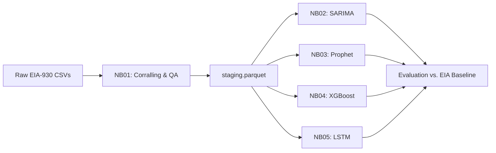
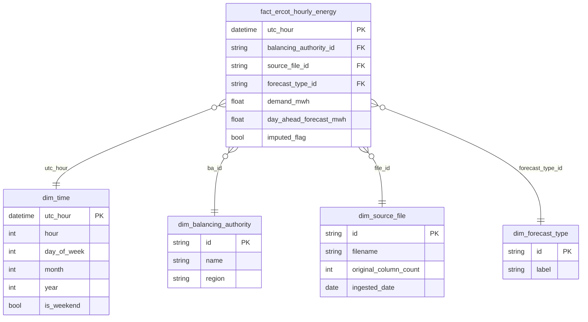

# GridIQ — ERCOT Hourly Demand Forecasting

The Texas grid doesn't forgive bad forecasts. ERCOT balances supply and demand in real time across one of the largest isolated power systems in North America, and when demand spikes unexpectedly the consequences are felt by millions of people. GridIQ asks a simple question: can a well-engineered machine learning pipeline beat the EIA's own day-ahead forecast using only three years of publicly available hourly balance data? We built the pipeline, ran the bake-off, and let the numbers answer.

<!-- TODO: replace placeholder with actual pipeline diagram after pushing notebooks -->

---

## Overview

GridIQ is a graduate data engineering and forecasting project completed for ADSP 31012 (Data Engineering Platforms) at the University of Chicago, Spring 2026. The core deliverable is a reproducible end-to-end pipeline: raw EIA-930 CSV files in, hourly demand predictions out, with four model families competing head-to-head against EIA's published day-ahead baseline.

**Key numbers:**
- **26,304** hourly rows · **52** columns after schema reconciliation
- **3 years** of data (Jan 2023 – Dec 2025) · **ERCO** balancing authority only
- **4 models:** SARIMA, Prophet, XGBoost, LSTM
- **Baseline:** EIA's own day-ahead demand forecast
- **Holdout:** full calendar year 2025 · sanity check on 2026-01

---

## The Data

Source: [EIA-930 Hourly Electric Grid Monitor](https://www.eia.gov/electricity/gridmonitor/) — BALANCE files, filtered to the ERCO (ERCOT) balancing authority.

The raw files were a moving target. Column counts shifted across the three-year pull: 44 → 65 → 74 → 52 columns depending on the vintage. Getting to a single canonical staging file required:

- Schema reconciliation across all file vintages
- Typo fixes in column headers and categorical values
- Deduplication of boundary-overlap rows between monthly files
- Flagging 79 imputed rows from a December 2025 reporting outage

The output of Notebook 01 is a single Parquet file — the staging artifact that every downstream notebook reads. Nothing downstream touches raw CSVs.

---

## Pipeline Architecture

---

## Star Schema

---

## Stack

| Layer | Tools |
|---|---|
| Data wrangling | Python · pandas · numpy |
| ML & forecasting | scikit-learn · statsmodels · Prophet · XGBoost · PyTorch (LSTM) |
| Pipeline artifacts | parquet · joblib |
| Relational schema | MySQL Workbench (EER diagram) |
| Document store | MongoDB (validation layer) |
| Graph relationships | Neo4j |
| Notebooks | Google Colab |

---

## My Role

I was the data engineering lead on a four-person team. My specific contributions:

- **Notebook 01 (corralling pipeline):** Designed and built the full data inventory, quality assessment, and schema-reconciliation pass. Every downstream notebook depends on the Parquet file this notebook produces.
- **XGBoost model:** Authored Notebook 04 — feature engineering, hyperparameter tuning, evaluation against the EIA baseline.
- **Shared Drive reorganization:** Consolidated the team's scattered working files into a single source-of-truth folder structure so everyone was working from the same canonical data at all times.

---

## Results

Train/test split: 2023–2024 train · 2025 holdout · 2026-01 sanity check.

Evaluation metrics: MAE, RMSE, MAPE, sMAPE, Bias, and skill score vs. EIA's day-ahead forecast.

| Model | MAE | RMSE | MAPE | sMAPE | Bias | Skill vs. EIA |
|---|---|---|---|---|---|---|
| SARIMA | TBD | TBD | TBD | TBD | TBD | TBD |
| Prophet | TBD | TBD | TBD | TBD | TBD | TBD |
| XGBoost | TBD | TBD | TBD | TBD | TBD | TBD |
| LSTM | TBD | TBD | TBD | TBD | TBD | TBD |
| EIA Baseline | — | — | — | — | — | 0.000 (reference) |

<!-- TODO: fill in results table after final notebook run -->

---

## Team

| Name | Role |
|---|---|
| Shane Dunkle | Data engineering lead · XGBoost model |
| Joel Gallo | Team member |
| Emmalucia *(last name TBD)* | Team member |
| Monica Para | Team member |

---

> Submitted May 27, 2026 · ADSP 31012 — Data Engineering Platforms · University of Chicago MS in Applied Data Science
