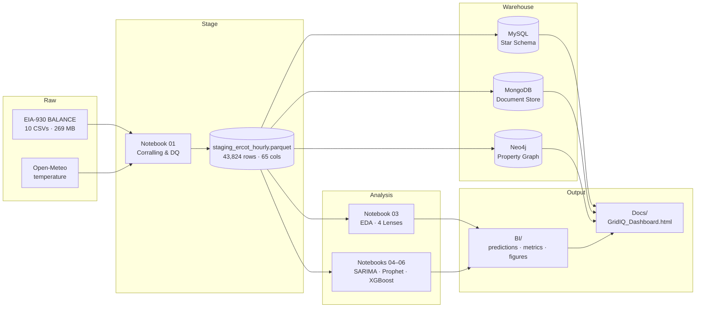

# GridIQ — ERCOT Energy Demand & Forecasting

> Course: **ADSP 31012 — Data Engineering Platforms for Analytics** · MS Applied Data Science, University of Chicago
> Team: **Isobar Analytics** — Shane Dunkle · Emmalucia · Joel · Monica

       

---

## Table of Contents

1. [Project Overview](#1-project-overview)
2. [Team & Role Assignments](#2-team--role-assignments)
3. [Data Sources](#3-data-sources)
4. [Pipeline](#4-pipeline)
5. [Folder Structure](#5-folder-structure)
6. [Environment Setup](#6-environment-setup)
7. [Notebook 01 — Data Inventory, Quality Assessment & Corralling](#7-notebook-01--data-inventory-quality-assessment--corralling)
8. [Notebook 02 — Schema & ETL](#8-notebook-02--schema--etl)
9. [Notebook 03 — EDA (Four Lenses)](#9-notebook-03--eda-four-lenses)
10. [Notebooks 04–06 — Forecasting Models](#10-notebooks-0406--forecasting-models)
11. [NoSQL — MongoDB & Neo4J](#11-nosql--mongodb--neo4j)
12. [Dashboard](#12-dashboard)
13. [Database Connection Details](#13-database-connection-details)
14. [Lessons Learned](#14-lessons-learned)
15. [Team Credits](#15-team-credits)
16. [References](#16-references)
17. [AI Disclosure](#17-ai-disclosure)

---

## 1. Project Overview

GridIQ is a data engineering and forecasting project built on ERCOT (Electric Reliability Council of Texas) hourly energy demand data. The central business question: **can a pipeline and forecasting models built on public data approach ERCOT's own published day-ahead demand forecast?**

The project covers the full data engineering lifecycle: raw data ingestion and quality assessment, a normalized relational warehouse, document and graph NoSQL stores, exploratory data analysis across four lenses, three forecasting models benchmarked against ERCOT, and an interactive dashboard — all packaged for reproducibility.

## 2. Team & Role Assignments

| Member | EDA Lens | Forecasting Model | Technical Workstream | Presentation Section |
|---|---|---|---|---|
| **Shane** | Temporal patterns | XGBoost | Dashboard + modeling framework | Exec summary, recommendations |
| **Emma (Emmalucia)** | Data quality | Prophet | ETL pipeline + automation | ETL, automation, data quality |
| **Joel** | Forecast accuracy | SARIMA | MySQL schema + SQL + README | Relational model, SQL insights |
| **Monica** | Cross-aggregation | — | EER + MongoDB + Neo4J | NoSQL design, EER, store comparison |

The project compares three forecasting models (XGBoost, Prophet, SARIMA) benchmarked against ERCOT's day-ahead forecast — no LSTM is in the final pipeline.

## 3. Data Sources

Raw data: U.S. Energy Information Administration **EIA-930 BALANCE bulk files** for balancing authority ERCO (ERCOT). Ten half-year CSVs covering January 2021 through January 2026 (UTC boundary). After filtering to ERCO, the staging dataset contains **43,824 hourly rows**.

| File | Date Range | ERCO Rows | Schema Era |
|---|---|---:|---|
| EIA930_BALANCE_2021_Jan_Jun.csv | 2021-01-01 → 2021-07-01 | ~4,344 | 44-col |
| EIA930_BALANCE_2021_Jul_Dec.csv | 2021-07-01 → 2022-01-01 | ~4,416 | 44-col |
| EIA930_BALANCE_2022_Jan_Jun.csv | 2022-01-01 → 2022-07-01 | ~4,344 | 44-col |
| EIA930_BALANCE_2022_Jul_Dec.csv | 2022-07-01 → 2023-01-01 | ~4,416 | 44-col |
| EIA930_BALANCE_2023_Jan_Jun.csv | 2023-01-01 → 2023-07-01 | 4,343 | 44-col |
| EIA930_BALANCE_2023_Jul_Dec.csv | 2023-07-01 → 2024-01-01 | 4,417 | 44-col |
| EIA930_BALANCE_2024_Jan_Jun.csv | 2024-01-01 → 2024-07-01 | 4,367 | 65-col |
| EIA930_BALANCE_2024_Jul_Dec.csv | 2024-07-01 → 2025-01-01 | ~4,400 | 65-col |
| EIA930_BALANCE_2025_Jan_Jun.csv | 2025-01-01 → 2025-07-01 | ~4,380 | 65-col |
| EIA930_BALANCE_2025_Jul_Dec.csv | 2025-07-01 → 2026-01-01 | ~4,390 | 65-col |
| **TOTAL** | **2021-01-01 → 2026-01-01 UTC** | **43,824** | **10 files** |

Hourly temperature for ERCOT metros is sourced from the **Open-Meteo Historical Weather API** and joined to the staging series for weather-based features (cooling and heating degree-days).

## 4. Pipeline



## 5. Folder Structure

```
GridIQ_Final_Project_MS_ADS_Spring_2026/
├── data/
│   └── staging/                # staging_ercot_hourly.parquet · ercot_temperature.parquet
├── Scripts/
│   ├── GridIQ_align_models_to_SARIMA.ipynb     # XGBoost + Prophet re-runner
│   ├── model_sarima.ipynb                       # SARIMA (dynamic harmonic regression)
│   ├── GridIQ_compare_windows.ipynb             # 3-yr vs 5-yr window comparison
│   ├── MODELS/                 # earlier model iterations
│   ├── SQL/                    # DDL, DML, analysis queries
│   ├── ETL/                    # corralling + warehouse load scripts
│   ├── EDA/                    # combined EDA notebook
│   └── ERD/                    # gridiq_eer.png (star-schema EER diagram)
├── noSQL/                      # MongoDB load + validation (Monica)
├── mySQL/                      # schema + load scripts (Joel)
├── BI/                         # model_preds_*.csv, metrics, mongodb_validation.txt, figures
├── Docs/                       # presentation deck, README, dashboard
└── Archive/                    # superseded versions & duplicates
```

## 6. Environment Setup

**Python 3.11+.** Notebooks run in Google Colab with Google Drive mounted at:

```
/content/drive/MyDrive/GridIQ_Final_Project_MS_ADS_Spring_2026/
```

Key libraries (pinned in `requirements.txt`):

| Library | Purpose |
|---|---|
| `pandas`, `numpy`, `pyarrow` | Core data processing |
| `sqlalchemy`, `pymysql` | MySQL connectivity |
| `pymongo` | MongoDB connectivity (real mongod 7.0 via tarball download; mongomock fallback) |
| `neo4j` | Neo4J Aura connectivity |
| `statsmodels` | SARIMAX / dynamic harmonic regression |
| `prophet` | Meta Prophet |
| `xgboost` | XGBoost gradient-boosted trees |
| `matplotlib`, `seaborn` | Visualization |

## 7. Notebook 01 — Data Inventory, Quality Assessment & Corralling

**Owner:** Joel · **Status:** ✅ COMPLETE

### What it does

- Builds a manifest of all 10 raw EIA-930 BALANCE CSVs (row counts, date ranges, encoding, columns).
- Filters to ERCO balancing authority only (43,824 rows).
- Reconciles schema differences across files (44 → 65 columns at the 2024 boundary).
- Renames all columns to `snake_case`.
- Flags and handles NaN rows (a 48-row block in Dec 2025; 7 isolated interchange NaNs forward-filled); `is_imputed` records every fill transparently.
- Flags solar generation at night (`solar_night_flag`).
- Produces the master staging file used by all downstream notebooks.

### Key output

`data/staging/staging_ercot_hourly.parquet` — **43,824 ERCO rows, 65 snake_case columns**

### Known data-quality findings

- **57 imputed rows total (0.13%)**; 48 of them cluster in Dec 2025 (the newest, least-settled month).
- **7 isolated single-hour NaNs** in `total_interchange_mw` (forward-filled).
- **777 solar-night anomaly flags** — largely sunrise/sunset edge effects, not data corruption.
- Pre-2024 fuel-generation columns are 100% null **by design** (schema expansion); structured nulls, not missing data.

## 8. Notebook 02 — Schema & ETL

**Owners:** Joel (schema DDL) + Emma (ETL pipeline) · **Status:** ✅ COMPLETE

### Star-schema overview


| Table | Type | Rows | Purpose |
|---|---|---:|---|
| `fact_ercot_hourly_energy` | Fact | 43,824 | One row per ERCOT hour — all numeric measures |
| `dim_time` | Dimension | 43,824 | Timestamp broken into queryable time attributes |
| `dim_balancing_authority` | Dimension | 1 | BA lookup (extensible to MISO, PJM, etc.) |
| `dim_source_file` | Dimension | 10 | Source-file lineage from Notebook 01 |
| `dim_forecast_type` | Dimension | 3 | ACTUAL / ERCOT_FORECAST / IMPUTED |

Design is fully 3NF: facts hold numeric measures only; descriptive attributes live in dimensions; surrogate keys with FK constraints enforce referential integrity; `DECIMAL(10,2)` is used for all MW values to avoid floating-point rounding. `is_imputed` and `solar_night_flag` are promoted to the fact table as transparent data-quality flags. Star schema was chosen over snowflake to optimize OLAP queries — simpler joins and faster aggregation.

### ETL pipeline

1. Loads the finalized `staging_ercot_hourly.parquet` dataset.
2. Validates row counts and schema consistency.
3. Constructs dimension tables and generates surrogate keys.
4. Populates `fact_ercot_hourly_energy`.
5. Exports BI-ready CSVs for dashboards and forecasting workflows.
6. Validates warehouse integrity after insertion.

### How to run

1. Open MySQL Workbench → execute `gridiq_ddl.sql` (or `gridiq_star_schema.sql`) → confirm all five tables created.
2. Open `02_schema_and_etl.ipynb` in Colab → **Run all cells**. The notebook loads the staging parquet, builds dimensions, populates facts, runs SQL analysis queries, and exports BI outputs.

## 9. Notebook 03 — EDA (Four Lenses)

**Owners:** All four team members · **Status:** ✅ COMPLETE

EDA is organized across four analytical lenses, each owned by one team member, producing both narrative findings and BI-ready figures.

### Lens 1 — Temporal patterns (Shane)

Monthly mean demand shows strong summer cooling peaks running ~40% above spring troughs. Year-over-year growth is evident, with 2025 running at or above prior years across most months. **Winter Storm Uri (Feb 2021)** appears as a clear anomalous spike.

### Lens 2 — Data quality (Emma)

The finalized staging dataset contains 43,824 hourly rows with continuous UTC timestamps from 2021-01-01 through the end of 2025 (gap-free after corralling). 57 imputed rows total (0.13%), 48 of which cluster in Dec 2025. 777 solar-night flags; 685 demand outliers — all genuine summer peaks (peak ~85,500 MW in Aug 2024) and the Uri event, not data errors. Pre-2024 fuel-generation columns are 100% null by design. Core operational variables (demand, demand_forecast, net_generation, interchange) maintain very high completeness throughout.

### Lens 3 — ERCOT forecast accuracy (Joel)

ERCOT's day-ahead forecast achieves **2.49% MAPE** on the 2025 test year — the benchmark the three models are measured against. In percentage terms ERCOT errs most in winter — February is the worst month at ~4.5% — while the steady summer cooling load is forecast most accurately (Aug ~1.9%). Texas winter demand is the volatile, weather-driven case.


### Lens 4 — Cross-aggregation: fuel mix & balance (Monica)

18 distinct fuel types are tracked from 2024 onward, across 38 raw `net_generation_mw_from_*` columns when battery-storage variants are split out. Natural gas leads at ~31% of generation; wind, coal, nuclear, and solar make up most of the remaining mix. Solar contributes most during daytime hours, offsetting load when the sun is up. A system-balance check confirms `net_generation + total_interchange` tracks demand to within ~180 MW on average, validating data integrity end-to-end.


## 10. Notebooks 04–06 — Forecasting Models

**Status:** ✅ COMPLETE

Three forecasting models, compared against ERCOT's day-ahead benchmark on a uniform held-out 2025 test year. All models forecast **24 hours ahead** — no near-future demand leakage.

### Shared methodology

- **Horizon:** 24 hours ahead, matched to ERCOT's day-ahead forecast.
- **Split:** train 2021–2024 · test on held-out 2025 (8,760 hours). Chronological, no shuffling.
- **Honest day-ahead discipline:** lag features use demand from at least 24 hours before the target hour. The 1-hour lag that would leak near-future persistence was explicitly dropped (see [Lessons Learned](#14-lessons-learned)).

### 10.1 SARIMA — Joel

A **dynamic harmonic regression SARIMAX** rather than a pure seasonal SARIMA: ARMA(2,0,2) errors on standardized demand, with Fourier terms capturing daily (K=4), weekly (K=3), and annual (K=2) seasonality, and cooling/heating degree-days as exogenous regressors. Standardizing the endogenous series and enforcing stationarity was essential to avoid divergence on the full 5-year training window.

| Metric | Value |
|---|---:|
| MAE | 6,532.20 MW |
| RMSE | 8,065.24 MW |
| MAPE | 11.42% |
| Test-set rows | 8,760 |

SARIMA is the classical statistical baseline; unlike XGBoost and Prophet it does not use explicit demand lags — it relies on the learned harmonic seasonal shape plus the ARMA short-term structure. It trails the lag-using models for that reason, and is the foil that demonstrates the value of recent-demand features in the comparison.


### 10.2 Prophet — Emma

Final configuration: flat growth, multiplicative seasonality (daily / weekly / yearly), changepoint prior scale 0.01, with **honest day-ahead regressors** — cooling/heating degree-days, temperature, plus demand lags at 24 hours and 168 hours and a lagged weekly average. An earlier configuration that included a 1-hour demand lag plus a 24-hour rolling average of demand produced a deceptively strong 1.56% MAPE; that result answers a 1-hour-ahead question, not the 24-hour-ahead one the benchmark measures. Held to honest day-ahead, Prophet lands at the figure below.

| Metric | Value |
|---|---:|
| MAE | 2,372.76 MW |
| RMSE | 3,056.51 MW |
| MAPE | 4.28% |
| Test-set rows | 8,760 |


### 10.3 XGBoost — Shane

Gradient-boosted trees (`n_estimators=600, max_depth=6, learning_rate=0.05`). Features: calendar (hour, day-of-week, month, is_weekend), cyclical encodings (sin/cos for hour and day-of-week), and demand lags at 24 and 168 hours. (The most recent design decision removed weather features from XGBoost to give a cleaner contrast with Prophet on whether weather or recent lags carry the signal; the number below reflects the prior with-weather run and will be replaced on the next execution.)

| Metric | Value |
|---|---:|
| MAE | 2,401.11 MW |
| RMSE | 3,090.37 MW |
| MAPE | 4.29% |
| Test-set rows | 8,760 |


### 10.4 Model comparison — 2025 test year

| Model | MAE (MW) | RMSE (MW) | MAPE | Rows |
|---|---:|---:|---:|---:|
| **XGBoost** | 2,401.11 | 3,090.37 | 4.29% | 8,760 |
| **Prophet** | 2,372.76 | 3,056.51 | 4.28% | 8,760 |
| **SARIMA** | 6,532.20 | 8,065.24 | 11.42% | 8,760 |
| **ERCOT (day-ahead benchmark)** | 1,379.33 | 1,887.11 | 2.49% | 8,712 |

**Headline finding:** given the same honest inputs (recent demand lags + degree-days), two very different model families — gradient-boosted trees and Prophet's additive decomposition — land within **0.01% of each other** at ~4.3% MAPE. SARIMA, which has no explicit demand lags and leans on a learned harmonic seasonal shape across a four-year heterogeneous training window, trails at 11.42% — the controlled contrast that shows recent-demand features drive accuracy toward ERCOT, not the choice of model family. ERCOT's 2.49% is not beaten: its forecast benefits from load-zone weather and generation-schedule data unavailable in public sources.

## 11. NoSQL — MongoDB & Neo4J

**Owner:** Monica · **Status:** ✅ COMPLETE

### 11.1 MongoDB — document store

Database `gridiq`, collection `hourly_readings`, MongoDB 7.0. The notebook auto-downloads and starts a real `mongod` server on localhost; if the server cannot start in some environments, it falls back transparently to `mongomock` with the same `pymongo`-compatible API. One document per hour — **43,824 documents loaded** — with nested measures, a `fuels` sub-document (empty pre-2024, populated thereafter), and quality flags. Indexes: `_id`, `ts` (unique), `(time.year, time.month)`, `flags.imputed`.

Sample document (real, from 2024-01-01T00:00 UTC):

```json
{
  "_id": "2024-01-01T00:00:00+00:00",
  "ts":  "2024-01-01T00:00:00+00:00",
  "ba":  "ERCO",
  "demand_mw":         44394,
  "forecast_mw":       42787,
  "net_generation_mw": 44370,
  "time":  { "year": 2024, "month": 1, "day": 1, "hour": 0, "dow": 0 },
  "fuels": {
    "natural_gas": 18497, "wind":  10946,
    "coal":         8353, "nuclear": 5115,
    "solar":        1056
  },
  "flags": { "imputed": false, "solar_night": false }
}
```

Validation cross-checks all match the data-quality figures: 43,824 documents loaded · 57 imputed · 777 solar-night · peak 85,544 MW at 2024-08-20 UTC. Validation summary written to `BI/mongodb_validation.txt`.

### 11.2 Neo4J — property graph

Property graph of the demand series: every `HourlyReading` node links to its `Month → Year` and to the `BalancingAuthority` (ERCO). A `NEXT_HOUR` chain threads all readings in temporal order — walk-the-timeline traversals replace expensive self-joins.

Validated graph (5-year series; the Jan 2026 UTC boundary hour expands the calendar tier to 61 months / 6 years):

| Node label | Count |
|---|---:|
| HourlyReading | 43,824 |
| Month | 61 |
| Year | 6 |
| BalancingAuthority (ERCO) | 1 |

| Relationship | Count |
|---|---:|
| `RECORDED_IN` (HourlyReading → BalancingAuthority) | 43,824 |
| `PART_OF` (Month → Year) | 61 |
| `BELONGS_TO` (HourlyReading → Month) | 43,824 |
| `NEXT_HOUR` (HourlyReading → HourlyReading) | 43,823 |

### 11.3 Why two NoSQL stores?

- **Document store (MongoDB):** flexible schema absorbs the 44→65 column expansion without migration. Best for high-volume time-series ingest with evolving fields.
- **Property graph (Neo4J):** relationship traversal as the primary access pattern. Hour → Month → Year roll-ups and timeline walks are first-class operations rather than self-joins.

## 12. Dashboard

**Owner:** Shane · **Status:** ✅ COMPLETE

`Docs/GridIQ_Dashboard.html` is a self-contained interactive HTML dashboard with hand-built SVG charts — no external dependencies, opens in any modern browser.

### Panels

- **KPI scorecard** — five-year span (2021–2025), 43,824 validated hourly records, three data stores, best-model MAPE, ERCOT benchmark MAPE.
- **Model comparison** — XGBoost · Prophet · SARIMA vs ERCOT benchmark.
- **ERCOT forecast error by month** — highest in winter (Feb), lowest in summer.
- **Three data-store cards** — MySQL (star schema, fact_demand + dimensions), MongoDB (1 doc/hour, nested measures + flags, absorbs the 44→65 column evolution), Neo4J (43,824 HourlyReading nodes with Month → Year chain).
- **Data-quality summary** — 0.13% imputed, 685 outliers (genuine summer peaks), 777 solar-night flags, 18 fuel types tracked from 2024.

### How to open

Double-click `Docs/GridIQ_Dashboard.html` in your file browser, or right-click → Open with → any browser. No server required.

## 13. Database Connection Details

**Owners:** Joel (MySQL), Monica (MongoDB, Neo4J)

Connection strings and credentials are **not** committed to this README. Live values are shared through the team's secure channel (Slack DM or password manager) and loaded at run time from environment variables. The templates below document the expected shape of each connection; substitute environment-specific values when running the notebooks.

### 13.1 MySQL — relational warehouse

Owner: Joel · Driver: SQLAlchemy + PyMySQL

```
Host:     <MYSQL_HOST>          # team's MySQL Workbench / RDS endpoint
Port:     3306                   # MySQL default
Database: gridiq
Username: <MYSQL_USER>
Password: set via env var MYSQL_PASSWORD (never in source)
Connection URI: mysql+pymysql://<user>:<password>@<host>:3306/gridiq
```

Tables: see §8 (Notebook 02). The DDL script `gridiq_ddl.sql` creates all five tables; the ETL notebook populates them from the staging parquet.

### 13.2 MongoDB Atlas — document store

Owner: Monica · Driver: pymongo · MongoDB 7.0 · Atlas replica set

```
Cluster:    <ATLAS_CLUSTER_NAME>.<atlas-id>.mongodb.net
Database:   gridiq
Collection: hourly_readings
Username:   <ATLAS_USER>
Password:   set via env var ATLAS_PASSWORD
Connection URI: mongodb+srv://<user>:<password>@<cluster>.<atlas-id>.mongodb.net/?retryWrites=true&w=majority
```

Indexes are created at load time by `noSQL/model_mongodb.ipynb`: `_id`, `ts` (unique), `(time.year, time.month)`, `flags.imputed`. The fallback path uses `mongomock` with the same `pymongo`-compatible API when Atlas is unreachable from a sandbox environment.

### 13.3 Neo4J AuraDB — property graph

Owner: Monica · Driver: `neo4j` Python driver · Bolt over TLS

```
Instance:  <AURA_INSTANCE_ID>.databases.neo4j.io
Bolt port: 7687
Username:  neo4j                # default Aura username
Password:  set via env var NEO4J_PASSWORD
Connection URI: neo4j+s://<aura-id>.databases.neo4j.io:7687
```

Validation queries (node counts, relationship counts, sample `NEXT_HOUR` walk) are checked in to `noSQL/` and the validated counts are reported in §11.2.

## 14. Lessons Learned

### Forecast-horizon discipline

A Prophet using a 1-hour demand lag scored 1.56% MAPE — beating ERCOT's 2.49% — but that's a 1-hour-ahead task, not the 24-hour-ahead one the benchmark answers. Held to honest 24-hour-ahead horizon, the same model scores 4.28%, which is the apples-to-apples figure. **Match the forecast horizon to the decision; guard against persistence leakage in autoregressive features.**

### Features beat algorithm

Given the same honest inputs (recent demand lags + degree-days), two different model families (gradient-boosted trees and Prophet's additive decomposition) land within 0.01% of each other. SARIMA, lacking explicit demand lags, trails at 11.42% — the contrast that shows the recent-demand features are doing the work, not the model family.

### One source of truth

Duplicate config and module files broke imports repeatedly across the team; we enforced a single canonical copy of each shared utility.

### UTC first

Storing UTC throughout and deriving local features sidestepped daylight-saving gaps entirely.

## 15. Team Credits

| Member | Role | Sections Owned |
|---|---|---|
| **Shane** | Core analytics, deck consolidator | XGBoost, dashboard, exec summary, recommendations |
| **Emma (Emmalucia)** | ETL lead, rehearsal lead | Prophet, ETL pipeline, data quality |
| **Joel** | Relational DB lead, README author | SARIMA, MySQL schema, SQL queries, forecast EDA |
| **Monica** | Infrastructure lead, submission | MongoDB, Neo4J, EER, data-store comparison |

## 16. References

- U.S. Energy Information Administration — **EIA-930 Hourly Electric Grid Monitor** (BALANCE bulk files). <https://www.eia.gov/electricity/gridmonitor>
- **Open-Meteo Historical Weather API** — hourly 2-m temperature for ERCOT metros. <https://open-meteo.com>
- **ERCOT** — Electric Reliability Council of Texas. <https://www.ercot.com>

Libraries: `pandas`, `numpy`, `pyarrow`, `xgboost`, `statsmodels` (SARIMAX), `prophet`, `sqlalchemy` / `pymysql`, `pymongo`, `neo4j`.
Data stores: MySQL, MongoDB, Neo4J. Visualization: HTML/SVG; Power BI / Tableau-ready exports in `BI/`.

## 17. AI Disclosure

This section documents AI tools used during the GridIQ project, in keeping with academic integrity practice for AI-assisted work. **All AI-generated outputs were reviewed, validated, and integrated by the team.** The team holds full responsibility for the project's intellectual content, methodology decisions, results, and conclusions.

### 17.1 Primary AI assistant

**Anthropic Claude** (claude.ai web interface) — used throughout the project by Shane as a coding and writing collaborator. Specific contributions:

- **Data engineering pipeline design.** Discussion of the corralling logic, the 44 → 65 column schema reconciliation, the staging parquet design, and the data-quality flag conventions (`is_imputed`, `solar_night_flag`).
- **Notebook scaffolding.** Turnkey "Run all" Colab notebook templates for the EDA, SARIMA, Prophet, XGBoost, MongoDB load/validation, and the 3-yr vs 5-yr window comparison. The team adapted each template to local Drive paths and individual model configurations.
- **Forecasting methodology.** Surfaced the 1-hour demand-lag leakage in the early Prophet configuration that produced the deceptive 1.56% MAPE, and proposed the honest 24-hour-ahead horizon discipline reported in §10 and §14.
- **SARIMA debugging.** Diagnosed convergence failures on the full 5-year training window and proposed the dynamic harmonic regression with standardized endogenous series and Fourier seasonal terms now reported in §10.1.
- **MongoDB infrastructure.** Produced the real `mongod` 7.0 download-and-launch pattern plus the `mongomock` fallback used in `noSQL/model_mongodb.ipynb`.
- **Dashboard.** Generated the self-contained HTML/SVG dashboard (`Docs/GridIQ_Dashboard.html`) with hand-built charts and no external CDN dependencies.
- **Presentation deck.** Built the 27-slide deck via `pptxgenjs`, including the embedded data-quality figures and the model-comparison summary.
- **Documentation.** Drafted earlier and current revisions of this README.
- **Cross-checking.** Identified inconsistencies between the deck and earlier README drafts; flagged the leaky 1.56% Prophet result before it became the reported headline.
- **Neo4J.** Assisted in debugging the Neo4J load scripts.
- **MySQL.** Converted the schema document into a SQL script to load for MySQL to help build out the EER diagram.

### 17.2 Other AI tools used by team members

Each teammate adds the AI tools they used independently for their workstream:

- **Joel** — _list any AI tools used for SARIMA exploration, SQL drafting, or README review (e.g. ChatGPT, GitHub Copilot, Cursor)._
- **Emma** — ChatGPT, GitHub Copilot for Prophet configuration and data-quality lens.

### 17.3 Reviewer policy

Every AI-generated artifact was reviewed by a human team member before being committed to the project. Suggestions that did not match observed data — SARIMA's initial divergence, the Prophet leakage, mismatches between deck and earlier README — were corrected or rejected. The methodology choices, model results, and conclusions reported in this document reflect human judgment informed by AI suggestions; **not AI judgment ratified by humans.**

### 17.4 Data integrity

No AI tool generated raw data, fabricated values, or wrote analysis without human review. All raw data comes from public sources (EIA-930 BALANCE files, Open-Meteo Historical Weather API, ERCOT). All model results in §10 were produced by executing the published notebooks on the validated staging dataset. The cross-checks between this README, the deck, the MongoDB validation output, and the Neo4J node/relationship counts represent independent verification that the numbers reported are internally consistent.


---

_Last updated: May 28, 2026._
